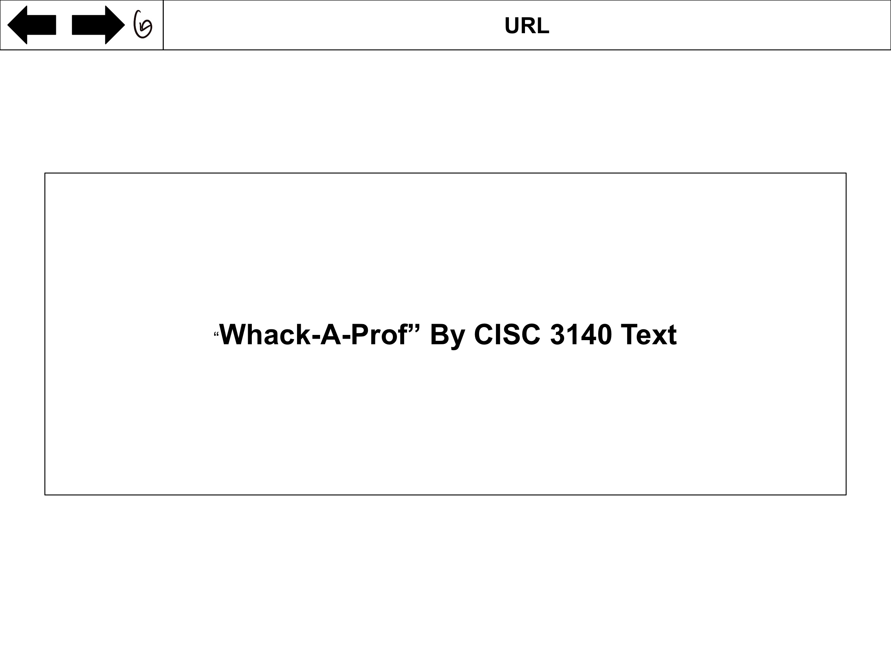
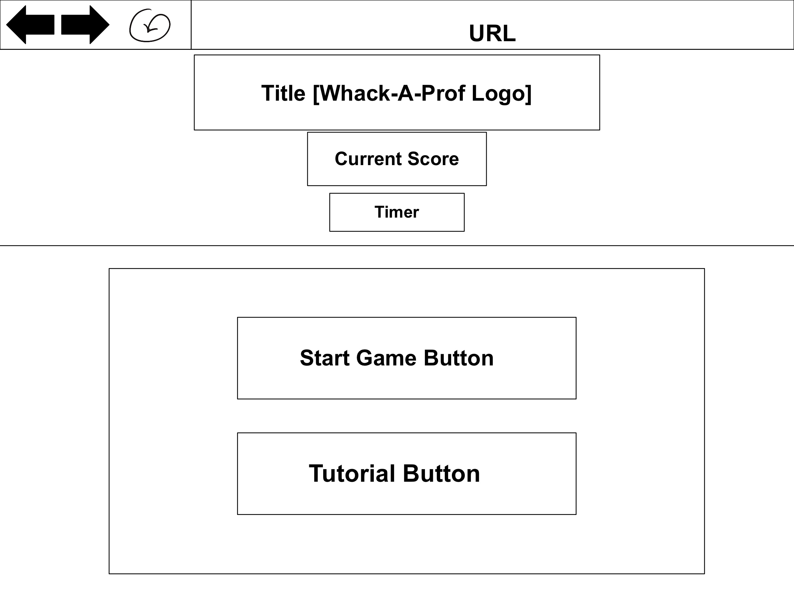
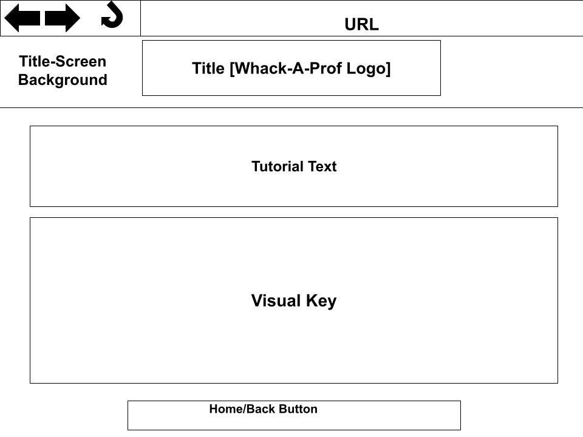

# Specification Document for Whack-A-Prof
##### <ins>Authors:</ins> Yvonne, Laura, Joanna,  Ali, Quincy, Wael
---

## **Table of Contents**
### [**1. Introduction**](#introduction)

[1.1: Purpose](#Purpose)

[1.2: Document Conventions](#Document-Conventions)

[1.3: Intended Audience](#Intended-Audience)

[1.4: Product Scope](#Product-Scope)

[1.5: References](#References)

### [**2. Overall Description**](#Overall-Description)

[2.1: Product Perspective](#Product-Perspective)

[2.2: Product Functions](#Product-Functions)

[2.3: User Classes and Characteristics](#User-Classes-and-Characteristics)

[2.4: Operating Environment](#Operating-Environment)

[2.5: Design and Implementation Constraints](#Design-and-Implementation-Constraints)

[2.6: User Documentation](#User-Documentation)

[2.7: Assumptions and Dependencies](#Assumptions-and-Dependencies)

### [**3. External Interface Requirements**](#External-Interface-Requirements)

[3.1: User Interfaces](#User-Interfaces)

[3.2: Hardware Interfaces](#Hardware-Interfaces)

[3.3: Software Interfaces](#Software-Interfaces)

### [**4. System Features**](#System-Features)

##### **Note: This Section is under Construction**

[**4.1: Start Game Button**](#Start-Game-Button)

[**4.2: Play Again Button (Game Over Screen)**](#Play-Again-Button)

[**4.3: Home Button (Game Over Screen)**](#Home-Button)

[**4.4: Holes or Sprite Spawn**](#Sprite-Spawn)

[**4.5: Sprites as Targets**](#Sprite-Target)

[**4.6: Cursor/Mallet**](#Cursor-Mallet)

[**4.7: Timer**](#Timer)

[**4.8: Player Score**](#Player-Scores)

[**4.9: Sounds Effects**](#Sound-Effects)

## **1. Introduction** 
---
### **1.1: Purpose** 

This document represents the Software Requirements Specification (SRS) for Whack-A-Prof. It is designed to specify the procedures our teams, backbone, quality assurance, specification documentation, and graphics, have used in the development process and describe the requirements specifications for our application with respect to end users. It will provide a detailed overview of our software product’s goals and parameters.

### **1.2: Document Conventions** 

When going through the final version of the document, specific typographical conventions are implemented to make the consumption of this document’s information easier for you. When sentences or phrases are **bolded** or <ins>underlined</ins>, it usually means that there is a change in topic. In other instances **bolded** words or phrases are used to emphasize something important that the reader must keep in mind. Headers are used to indicate the topic that will be discussed in each section. When a sentence or word is surrounded by “quotations” the sentence or word is from a source or an idea that is not originally ours. Bullet points, or lists, are used to easily list information in order to avoid confusing paragraphs. Lines and dividers in the document are used to have further organization of information for the reader to easily see when a section starts and ends. Finally, any links provided in the document are there to show what it is that we are referencing and where the outside sources we use come from. The only other time you will see a link that does not do this is in the table of contents.

### **1.3: Intended Audience** 

This SRS is organized into 4 sections, each with varying subsections. The document is intended for both technical and non-technical audiences, such as developers, users, testers, and documentation writers. All readers should start with the **Introduction** and **Overall Description** to get a sense of the purpose and scope of the product. Users should follow the User Documentation (subsection 2.6) which will give a general tutorial on how to use the product. Section 3: **External Interface Requirements** and Section 4: **System Features** are intended for developers, testers, and documentation writers. These two sections will give specific details on the software features of the product itself.

### **1.4: Product Scope** 

The skeleton of the project will be created using the scripting language of Javascript. The goal with Javascript is to create the bare minimum functions of a “Whack-A-Prof” game. Javascript will be responsible for signifying the space in which the game will take place, animating the pictures that will represent the characters and the cursor, buttons, etc. that the user will be using to interact with the game. Additionally, Javascript will be giving these characters value, allowing the user to feel a form of interaction with said characters by gaining or losing points based on what character they have interacted with. The space and structure that the game will be developed in will be created by HTML. HTML will display the game on a web browser and create containers and borders in which the buttons, characters, and other visual blocks will be placed in. Moreover, while HTML will be able to visually show the user the game, CSS will further assist HTML in giving better visual effects to the web browser. On the other hand, Aseprite and LibreSprite will be used to create the visuals of the characters. Both programs are sprite and pixel art editing tools. Moreover Skia, a 2D graphics library, Ninja, a build system, CMake, an open source software which generates a system’s build file, and PureRef, a image referencing tool, will be used by the design team to assist in the designing of the characters. Finally, GitHub and the SVN service provided by GitHub is used by everyone in the team in order to keep programs, pictures, documents, and other forms of files in one organized and accessible setting.

### **1.5: References** 

All references in this documentation will be referred to the items below.

**Template for documentation**:

* [1] K.E. Wiegers, "Software Requirements Specifications for <Project>", 1999. [Online].
	 Available: https://web.cs.dal.ca/~hawkey/3130/srs_template-ieee.doc.

* [2] IEEE Standards Association (2011, Lass Accessed October 2022) Systems and software engineering –
	Life cycle processes – Requirements engineering, Standard. (IEEE 29148-2011)
	Available: http://standards.ieee.org/findstds/standard/29148-2011.html.

**Connecting Github with SVN**:

* [3] "Support for subversion clients," GitHub Docs. [Online]. Available:
	https://docs.github.com/en/get-started/importing-your-projects-to-github/working-with-subversion-on-github/support-for-subversion-clients.
	[Accessed: 29-Oct-2022].

**Graphics**:

* [4] *CMake*. (Version 3.25). Kitware. [Online]. Available:  https://cmake.org/

* [5] *Aseprite: Animated sprite editor & pixel art tool (Windows, macOS, Linux)*.
	(Version 1.2.40). Igara Studio. [Online]. GitHub. Available: https://github.com/aseprite/aseprite

* [6] D. Capello. *Skia*. (Version Skia-m102). Igara Studio. [Online]. GitHub.
	Available: https://github.com/aseprite/skia/

* [7] E. Martin, J. N. Hasse. *Ninja-build*. (Version 1.11.1). J. N. Hasse. [Online]. GitHub.
	Available: https://github.com/ninja-build/ninja

* [8] D. Capello. *LibreSprite*. (Version 1.0). Igara Studio. [Online[. GitHub.
	Available: https://libresprite.github.io/#!/

**Backbone**:

* [9] T. Berners-Lee. *HTML*. (Version HTML5). [Programming Language]. World Wide Web Consortium.
	Available: https://www.w3schools.com/html/

* [10] H. W. Lium. *CSS*. (Version 2.1). [Programming Language]. World Wide Web Consortium.
	Available: https://www.w3schools.com/css/

* [11] B. Eich. *JavaScript*. (Version ES2022). [Programming Language]. Oracle Corporation.
	Available: https://developer.oracle.com/languages/javascript.html

## **2. Overall Description** 
---
### **2.1: Product Perspective** 

This product is a new “Whack- A-Mole” inspired game where the functions are the same but the settings are altered. Instead of moles, the user will interact with school faculty and students to accumulate or depress points. The following are features included with the web game:

* Cross Platform Support: The game is supported by most of the popular web browsers that can be downloaded in most operating systems

* Number of users who can be on the website: While an exact number can not be given a sizeable amount of users can go on the website at the same time to play the game

* Storing Scores of User: The website will be utilizing the user's local storage in order to keep track of their individual scores

### **2.2: Product Functions** 

The product must provide, at a minimum, the following functions to the users within this SRS document.
* Provide a User Interface (UI) to play the game
* Make data/scores available in local storage
* Allow users to click buttons to start the game, restart the game, and return to the home page
* Display a tutorial on the home page for guidance on how to play the game

### **2.3: User Classes and Characteristics** 

Users of the product should have basic knowledge of web technology and operating the internet. The user interface will be friendly enough to guide the user and help with starting the Whack-A-Prof game.

### **2.4: Operating Environment** 

The server-side components of the software system can operate on any operating system, including but not limited to Linux, Windows, and macOS. The client-side components of the software system must operate within common web browser environments. The minimum set of browsers that must be supported is:

- Google Chrome

- Apple Safari

- Microsoft Internet Explorer

- Mozilla Firefox

- Fedora WS 36

- Visual Studio Code V. 1.72.2

- Notepad++ v8.4.6

### **2.5: Design and Implementation Constraints** 

This program will have complications when used on a tablet or phone as it is designed to be better played on a desktop or laptop. Additionally, the game doesn't have adequate backend security because of how Javascript is structured and there is no user authentication. However, the only data or information that will be vulnerable to the user is their score from the game which will be stored in a text file. Finally, not all errors and bugs with the code will be caught immediately. 

### **2.6: User Documentation** 

* Tutorial Overview:
	+ The game assumes basic knowledge of the original "Whack-A-Mole" arcade game. Users start by pressing on the start button on the title screen that will take them to the game screen. At the game screen, they will utilize their mouse and cursor to interact with the sprites on the screen. The user may use the cursor, which will assume a hammer, to hit the sprites. If professors, deans, and admins are hit, the user will gain points. If the user hits a student, they lose points. The game ends when the timer reaches 0 seconds and the player can compete with themselves for higher score.

* Walkthrough:

* Rules:

There are currently no outside sources or tutorials for this game. Once available, they will be updated.

### **2.7: Assumptions and Dependencies** 

Users must access the game through a desktop. If the game is accessed through any other devices or browsers that are otherwise not listed in Section 2.4, it may bug or become unplayable. Users who play this game are assumed to have access to a usable web browser and know how to use the internet and input devices, such as the mouse, which is a key feature in playing the game.

## **3. External Interface Requirements** 
---
### **3.1: User Interfaces** 

When the game first launches, there will be an animation displaying the name of the game, Whack-A-Prof, and the class that worked on this project, CISC 3140 (Figure 1). The start game screen (Figure 2) will display the title of the game, start game button, and tutorial button, respectively. The start game screen will also have its individual background visual. Clicking the tutorial button will trigger the tutorial screen (Figure 3). This screen includes the title, tutorial text, a visual key showcasing the characters respectively. Clicking the back home button will trigger the title screen to appear once again. Additionally the tutorial-screen will have the same visual background as the title screen. When clicking the Start Game button, the Game Screen will be triggered (Figure 4) where the title, current score, timer, and the gameboard will be shown respectively. The gameboard will consist of 9 holes laid out in a 3x3 grid. The sprites that will be transitioning out of the holes are either professors, admins, or students. Once the timer is at 0 seconds, the game over screen (Figure 5) will be initiated. There will be a game over text, score, high score, play again button, and home button, respectively. The game over screen will also have its own visual background different from the rest.   

**Figure 1**

</img>

**Figure 2**

</img>

**Figure 3**

</img>

**Figure 4**

</img>

**Figure 5**

</img>

### **3.2: Hardware Interfaces** 

The client-side components of Whack-A-Prof can be executed on both personal-class computers and workstation-class computers. The game will require browser support and an internet connection to run it.

### **3.3: Software Interfaces** 

The game requires Javascript support in order to be run on a browser. The game should be supported in all browsers however the game has full support on a firefox browser. There are only compatibility issues when the size of the screen is too big because the proportions of the background and other graphical features can be altered. 

## **4. System Features** 
---
### **4.1: Start Game Button (Start Game Screen)** 

* 4.1.1
	* The start game button will appear on the initial start game screen. This button is a high priority because it is the only method of starting the game. The game and timer will immediately start after it is pressed.

* 4.1.2
	* This feature is triggered when the user uses their mouse to left-click the button.

* 4.1.3
	* The button should only be present on the initial screen and not on the game or game over screens.
	* TBD
		* Start Game Button does not start the game
			* Reload the game
			* Check your internet connection and browser support
	
### **4.2: Play Again Button (Game Over Screen)** 

### **4.3: Home Button (Game Over Screen)** 

### **4.4: Holes or Sprite Spawn** 

* 4.4.1:
	* The holes or sprite spawns will appear on the screen once the game screen has been triggered to appear. The sprite spawns are of high priority as they are needed for two indications: that the game is working and about to begin, and that the game is in session. The holes or sprite spawn is where the sprites (i.e Professor, Student. Dean, etc.) will spawn from. 

* 4.4.2:
	* The visual component of the sprite spawn will be triggered at the beginning of the game screen being triggered after the user clicks the start button in the title screen. The function of the sprite spawn will be triggered after the visual component of the sprite spawn is triggered and once the timer begins to count down when the game starts.

* 4.4.3:
	* The holes or sprite spawns should only be displayed on the game screen, and not on the title screen or game over screen.
	
	* TBD:
		* When Sprites do not spawn
			* Restart browser or internet connection
			* Reload Game

 		* When the Sprites are not in their own container or when the sprite spawn cause the sprite to appear abnormal
			* Restart browser or internet connection
			* Reload Game

### **4.5: Sprites as Targets** 

* 4.5.1:

	* The sprites or sprite target will appear on the screen once the game begins and when the sprite spawns have both visually and functionally been triggered. The sprite target is high priority because the sprites are used to allow user interaction with the game as the sprites are what change the amount of points or time the user can accumulate. Users click on the sprite and that will cause the timer to increase in value and the score of the user to either increase or decrease depending on what sprite target was clicked on.

* 4.5.2:

	* The feature is triggered once the user TBD clicks on the sprite target. The user’s score will be affected as follows:

		* Professor:
			* Increase score by 15 points

		* Student:
			* Decrease score by half (your-score/2)

		* Dean:
			* Increase score by 20 point

		* Admin:
			* Increase Time by 1 minute (60 seconds)

* 4.5.3:

	* The sprite targets should only appear in the game screen when the game starts.

	* TBD:
		* When the sprites do not spawn or show

			* Restart browser or internet connection
			* Reload Game

		* When score doesn’t increase or decrease upon clicking the sprite

			* Restart browser or internet connection
			* Reload Game

		* If the users score increases or decreases abnormally (i.e: upon clicking student sprite the users score increases instead of decreasing)

	 		* Restart browser or internet connection
			* Reload Game

		* The Sprites appear anywhere outside of a spawn hole

			* Restart browser or internet connection
			* Reload Game

### **4.6: Cursor/Mallet** 

* 4.6.1:
     * The cursor will be displayed as a mallet within the game screen. It is a high-priority item because it is the only way to navigate the user interface and click the buttons.

* 4.6.2:
     * The mallet will automatically display upon clicking the start game button. This feature will be removed once the game is over. 

* 4.6.3:
     * The cursor should allow the user to select objects on the screen, specifically click on the sprites to “hit” them for points.

### **4.7: Timer** 

* 4.7.1:
     * The timer appears on the start screen. The timer is a high-priority item because it indicates to the user how much time they have left to play the game. The game will always start by counting down from 2 minutes (120 seconds).

* 4.7.2:
     * The feature is triggered as soon as the start begins, or in other words right when the user presses the start game button.

* 4.7.3:
     * The timer should appear below the current score on all screens. The time left may be changed if the user hits an admin sprite which will add 1 minute (60 seconds) to the timer.

### **4.8: Player Score** 
* 4.8.1
	The player’s scores are dependent on clicking on sprites. Hitting the professor or dean will increase the player’s points by 15 or 20 points, respectively, while hitting admin will have no effect on the score but will add 60 seconds of time to the timer, and hitting the student will half the current amount of points. This is a high-priority feature because the player either wins or loses the game based on their score. The score will appear on only the game screen.

* 4.8.2
	The score will automatically update itself when the player left-clicks on the sprite.
* 4.8.3
	Through HTML and JavaScript, there is a listener function that looks out for clicks on certain characters. If that character is clicked then there will be an event that happens.
	The score of the player should only be affected when clicking on their appropriate sprite. 
		-When sprites don’t increase or decrease the score to their respective value
		-When admin affects the score instead of the time
		-When sprites don’t work at all when clicked
		-Any other forms of abnormal effects upon clicking

### **4.9: Sounds Effects** 
